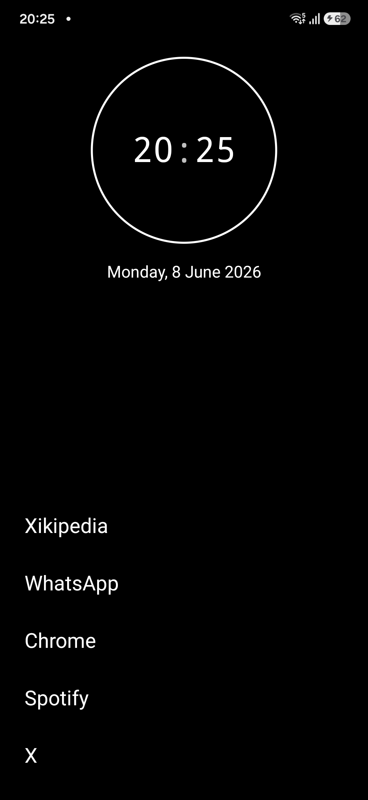
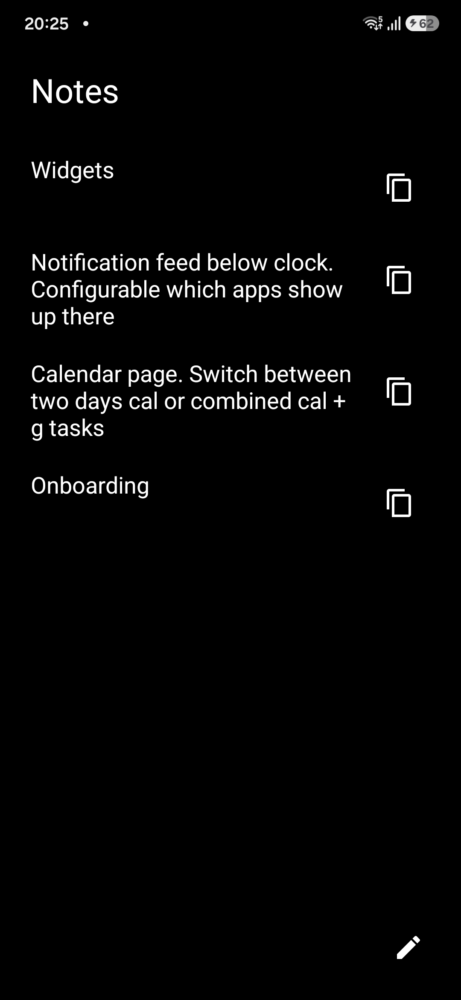
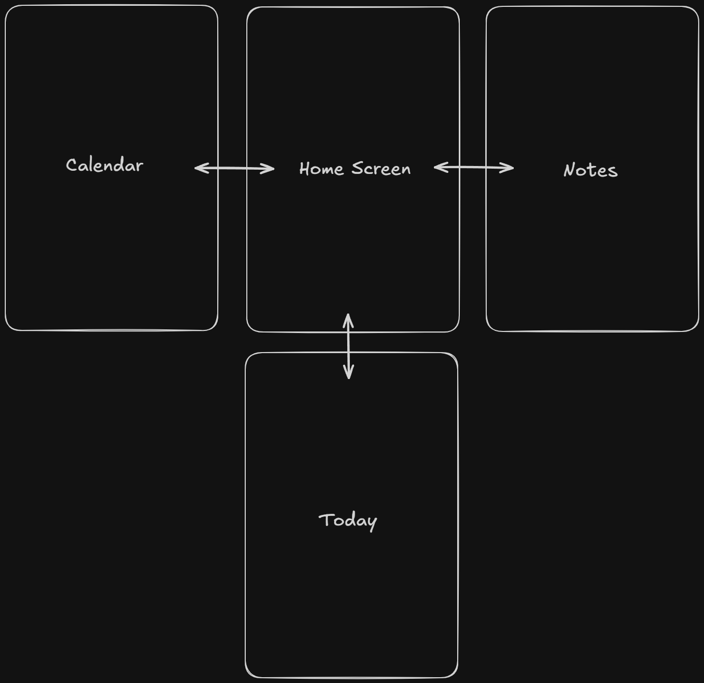

# Text Launcher

Text Launcher is a minimal, distraction-free Android launcher for people who want their phone to feel calmer and more intentional. It replaces icon grids and engagement-heavy surfaces with a quiet text-first home screen, fast app search, lightweight planning prompts, and optional screen-time context. The installed app label is `txt`.

The goal is simple: make the phone useful without making it irresistible.

## Screenshots

<p>
  
  
</p>

## Screen Layout

The launcher is organized around a central Home screen. Calendar and Notes sit to the left and right, while Today sits below Home for glanceable widgets.

<p>
  
</p>

## Features

- Text-first home screen with configurable app shortcuts, text alignment, and wallpaper dimming.
- Fuzzy app search for quickly opening the app you meant to find, including Enter/Go to launch the top result.
- Optional date, analog/digital clock behavior, clock-app long press, and quick access actions.
- Screen-time page with today usage, weekly usage, top-app recap, and daily average.
- App blocking prompts that slow down impulsive launches.
- Daily app budgets for selected apps.
- Intention tracking so each intentional app launch can be paired with a planned duration.
- Notes page for quick local text notes and optional voice notes.
- Calendar page for upcoming events, with selectable calendars.
- Today page with a small configurable widget grid for glanceable information.
- Today widgets for weather, the next calendar event, active notifications, and a pinned note.
- Pinned notes that stay at the top of the notes page and can appear on the Today page.
- Configurable gestures for opening Screen Time or locking the screen.
- Context menus for removing shortcuts, blocking apps, and starting Android's app uninstall flow.
- Settings for hiding or showing launcher pages and adjusting shortcut limits.
- Local-first storage using Android shared preferences.

## Core Screens

- Home: the default launcher surface, with selected shortcuts, search, clock/date options, and quick actions.
- Calendar: upcoming events from the device calendars the user chooses to show.
- Notes: quick local notes, pinned notes, and optional voice-note recording.
- Today: a small widget grid for weather, next event, active notifications, and a pinned note.
- Screen Time: usage summaries, weekly context, app budgets, and intentional-launch prompts.

## Philosophy

Text Launcher is built around friction with a purpose. It should still be easy to call someone, check your calendar, write a note, or open a tool you genuinely need. It should just be a little harder to fall into a loop you did not choose.

This project is intentionally small, plain, and hackable. It favors Android platform APIs and simple Kotlin over heavy framework choices.

## Permissions

Text Launcher can be set as your Android home app. Some features ask for optional permissions or use Android system capabilities:

- Calendar access: used only to show upcoming calendar events in the launcher.
- Approximate location and network access: used only by the Today weather widget to request current weather from Open-Meteo.
- Microphone access: optional, requested only when starting a voice-note recording.
- Notification access: optional Android special access, requested only when adding the notifications widget, used only to show active notifications on the Today page.
- Usage access: used only to calculate screen-time summaries and app budget prompts.
- Accessibility access: optional, used only when the lock-screen gesture is enabled and triggered. Text Launcher uses Android's lock-screen accessibility action instead of Device Admin so biometric unlock can continue to behave like a normal screen lock.
- Package deletion request: used only when you choose Uninstall from an app context menu. Android still shows its normal uninstall confirmation flow, and Text Launcher removes shortcuts for apps after they are uninstalled.

The app stores launcher settings, Today widget layout, text notes, voice-note audio, shortcuts, app budgets, and intention data locally on the device. See `PRIVACY.md` for more detail.

## Requirements

- Android Studio or the Android command-line tools.
- JDK 17.
- Android SDK with compile SDK 36 installed.
- Android 8.0 or newer on device or emulator.

## Build

From the repository root:

```powershell
.\gradlew.bat test
.\gradlew.bat assembleDebug
```

On macOS or Linux:

```sh
./gradlew test
./gradlew assembleDebug
```

The debug APK will be generated under `app/build/outputs/apk/debug/`.

## Development

This is a Kotlin Android app using XML layouts and ViewBinding. The main app code lives under:

- `app/src/main/java/com/example/textlauncher/data`
- `app/src/main/java/com/example/textlauncher/domain`
- `app/src/main/java/com/example/textlauncher/ui`
- `app/src/main/res`

The rough split is:

- `data`: repositories for Android system data and local persistence.
- `domain`: small models and enums shared across the app.
- `ui`: `MainActivity`, `HomeViewModel`, adapters, custom views, and UI controllers.
- `res`: XML layouts, drawables, strings, dimensions, colors, and launcher assets.

Run unit tests before opening a pull request:

```sh
./gradlew test
```

For a deeper contributor guide, architecture map, privacy/security checklist, and release checklist, see [`docs/DEVELOPMENT.md`](docs/DEVELOPMENT.md).

## Contributing

Contributions are welcome. Please read `CONTRIBUTING.md`, `CODE_OF_CONDUCT.md`, `SECURITY.md`, and `PRIVACY.md` before opening issues or pull requests.

Good first areas include:

- Launcher ergonomics and accessibility.
- Better screen-time summaries.
- More tests around search, budget prompts, and settings persistence.
- Documentation and setup improvements.

## License

Text Launcher is open source under the MIT License. See `LICENSE` for details.
